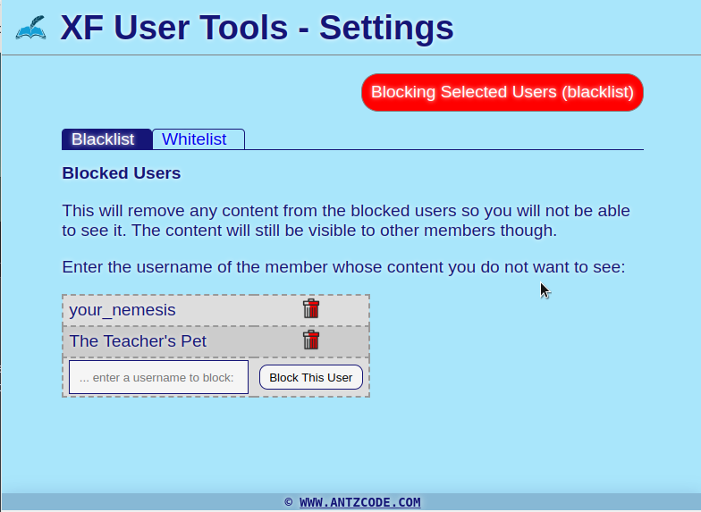

# Xenforo-User-Tools

A Chrome Browser Extension that provides advanced user management.

## Features

- User Blacklist: automatically hide the content of selected users
- User Whitelist: only show content from selected users

## How to use it

After installing the extension in Chrome browser, click the extension's icon in the Extensions menu:

Into the Blacklist, type each username that you want to block and it will appear in the list. Same for the Whitelist, enter the usernames of any members that you want to only see content from.

When you reload the forum, it will read the users from the blacklist and it will remove any content from the page that those users have created.

Likewise, if reading in the whitelist mode, it will remove all content from the page except for content created by the approved users.

You can toggle from Blacklist to Whitelist mode by clicking the button. It changes from red to green to show whether it is in the mode of blocking or permitting content. When the button is grey it means the extension is not filtering any content from any user.

## How to install

In Chrome Extensions menu, enable "Developer Settings" and click the "Load Unpacked" button. Navigate to the unzipped folder that you have downloaded from the [Github Project Page](https://github.com/AntzCode/Xenforo-User-Tools).

-or-

Install from the [Google Chrome Webstore](https://chromewebstore.google.com/search/xenforo%20user%20tools)

Bugs or feature requests, use the [Github Issue Tracker](https://github.com/AntzCode/Xenforo-User-Tools/issues).

©2024 - AntzCode Ltd [<www.antzcode.com>](https://www.antzcode.com)